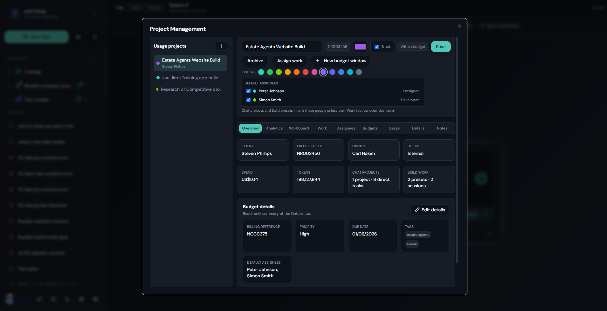
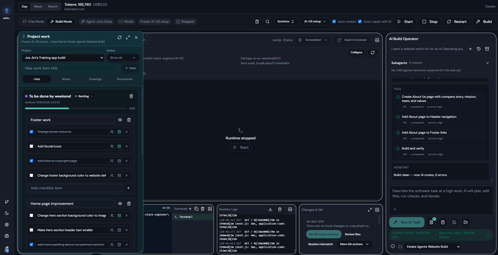

<p align="center">
  
</p>

# OpenDeskmate

An open-source local-first AI work operating system for Windows forked from the Openwork for Mac project. It offers OpenClaw-style capabilities including multi-agent workflows, connector routing, automation loops, tool-driven execution, and tracked subagent orchestration, but with a full desktop settings UI instead of CLI-only setup.

Run locally with your own provider keys, configure models, permissions, connectors, plugins, and automation from the app, and install directly on Windows as an installer or portable executable without a hosted OpenDeskmate cloud dependency.

OpenDeskmate is built for the full loop around AI work: chat, build automation, project budgets, Workboard tracking, Git review, screenshots, notes, documents, saved prompts, reusable workflows, and project handoff.

---

## What OpenDeskmate Is For

OpenDeskmate is built for people who want local agent workflows without giving up operational control. It is aimed at freelancers, agencies, consultants, solo builders, developers, technical operators, and power users who need more than a single chat window:

- Run agent tasks against local files and real project workspaces on Windows.
- Switch between quick chat interactions and longer-running build workflows.
- Track AI usage and estimated cost by client, product, internal project, Chat project, Build preset, or Build session.
- Turn AI output into project work items, rich notes, drawings, documents, RTF exports, and follow-up checklists.
- Review code changes, Git status, branch state, remotes, commits, pushes, and mismatch recovery from a guided desktop panel.
- Route connectors, tools, and automation into the right agent with explicit settings.
- Monitor subagents, runtime permissions, usage, and task state from the desktop UI.
- Extend the app with skills, plugins, help docs, and connector-backed workflows.

---

## Why It Differs From Openwork / OpenClaw

OpenDeskmate keeps the local-first, agentic power of Openwork and OpenClaw, but makes it much easier to operate day to day on Windows. The main difference is usability: instead of relying on CLI-heavy setup, scattered config, and hidden runtime state, OpenDeskmate brings the working surface and the configuration surface into a straightforward desktop UI.

- Configure models, agents, subagents, permissions, connectors, plugins, schedules, voice features, and pricing from the app.
- Use Chat Mode for fast prompts or Build Mode for workspace-driven implementation without changing tools.
- Inspect task history, activity timelines, reasoning bubbles, edited-file summaries, terminals, runtime logs, screenshots, and child-agent runs in one place.
- Use **Project Management** to connect Chat projects, direct Chat tasks, Build presets, and Build sessions to budgets, work items, notes, assignees, documents, drawings, and usage analytics.
- Use **Changes & Git** to make Git easier for non-experts with repository status, changed file counts, additions/deletions, commit/push guidance, remote setup, branch tools, and mismatch/conflict recovery.
- Keep advanced capabilities available without making normal setup and operation feel like developer-only infrastructure.

---

## Features

- **Runs locally** - Your files and secrets stay on your machine by default.
- **Bring your own AI** - OpenAI, Anthropic, Google, xAI, Ollama, plus custom OpenAI-compatible providers/models.
- **Local model controls** - Use Ollama with capability levels and context limit overrides so small local models can stay lightweight while larger models can use more of the desktop/tool stack.
- **Chat Mode + Build Mode** - Use fast task/chat flows or switch into a full workspace-oriented build surface with file tree, editor tabs, task history, runtime preview, screenshots, Changes & Git, runtime logs, and embedded terminal sessions.
- **Prompt Navigator** - Jump through long Chat Mode and Build Mode conversations by user prompt using a right-side prompt rail and preview list.
- **Chat appearance controls** - Customize the Chat Mode background and show agent avatars on answers while keeping answer bubbles readable.
- **Project Management** - Create usage projects with client/project details, owners, assignees, budget contents, budget windows, analytics, notes, documents, drawings, and project work items.
- **Per-project budgets and usage** - Track input hit tokens/cost, input miss tokens/cost, output tokens/cost, total tokens, estimated cost, warning limits, blocking limits, and tracking-only projects.
- **Workboard** - Manage AI-related work in Table, Kanban, Timeline, and Calendar views with states, checklist lists, assignees, due dates, progress bars, notes, documents, drawings, and color badges.
- **Changes & Git** - Review edited files, additions/deletions, staged/unstaged/untracked state, branch/remote/upstream status, commit, push, add remotes, create branches, and resolve mismatches or conflicts.
- **Runtime screenshots and annotation** - Capture selected areas or full runtime preview pages, annotate with shapes/arrows/text/freehand drawing, export, attach to prompts, or save to project work items.
- **Autonomous Build smoke testing** - Let Build Mode agents inspect runtime status, start/restart previews, capture screenshots, read logs, run checks, inspect page structure, and test safe UI interactions.
- **Answer capture and export** - Copy rich answers, pop out long answers, save Chat/Build answers as formatted project notes, export RTF files, and attach saved files as project documents.
- **Multi-agent workspaces** - Per-agent role name, avatar, workspace defaults, and model/provider override with global fallback.
- **Tracked subagents** - Per-agent subagent controls, global subagent monitoring, run/session modes, inherited context rules, and close/archive controls.
- **Active Automation Mode per agent** - Enable agentic loop behavior with configurable heartbeat schedules.
- **Permission policy controls** - Configure runtime permission defaults, recent audit history, and per-agent permission overrides for more autonomous or more locked-down agents.
- **Session-key gateway + dynamic routing** - Route traffic from connectors into the right agent/account binding at runtime.
- **Messaging Connector Extensions** - Multi-instance connector support (for example multiple Telegram/Discord bots), access policies, ID allowlists, and runtime health/testing.
- **App Connector Extensions** - Connectors for Notion, Trello, Obsidian, GitHub, Slack, Dropbox, Canva, OneDrive, Supabase, Google apps, Figma, Miro, Outlook, and more.
- **OAuth + local/public callback modes** - Supports desktop callback, loopback callback, and public HTTPS callback workflows.
- **User Skills + agent-generated skills** - Create/import/edit/configure skills, private-by-default sharing, versioning, rollback, and test flows.
- **Plugins** - Discover bundled and managed plugins with manifests, commands, hooks, tools, help docs, diagnostics, and enable/disable lifecycle controls.
- **Slash commands + launcher flows** - Built-in command surfaces for navigation, agent actions, Build Mode actions, and plugin-contributed commands.
- **Saved prompts and recipes** - Use bundled recipes, custom saved prompts, categories, one-click insertion, and reusable workflow prompts in Chat Mode and Build Mode.
- **Desktop + WebChat parity** - Saved prompts, add files, incognito mode, work-in-folder, voice wake/talk mode, model badge, context estimate badge/details, and message copy helpers.
- **Activity timeline and recovery** - See model state, tool calls, permissions, errors, retries, final responses, reasoning bubbles, raw logs, and recovery actions when a task stalls.
- **Agent loop safeguards** - Detect repeated successful tool-call loops and stop runaway inspection cycles before they make the app unusable.
- **Usage + pricing visibility** - Track token usage globally and per project, add provider pricing, and estimate cost inside the app shell.
- **In-app Help system** - Markdown-driven help pages with sidebar navigation, search, syntax highlighting, asset/link support, step-by-step guides, troubleshooting, and live reload from a user-editable folder.
- **Open source** - MIT licensed and fully transparent.

---

## Newer Work-OS Capabilities

OpenDeskmate has moved beyond a basic chat/build harness into a project-aware AI work surface:

- **Project budgets** let users attach Chat and Build work to a budget project and track costs by project.
- **Workboard** turns AI output into tasks, checklists, Kanban items, timeline entries, notes, drawings, and linked documents.
- **Changes & Git** helps inexperienced Git users review file changes, understand branch/remote state, commit, push, and resolve mismatches.
- **Runtime screenshots** let users capture and annotate active previews, then attach the screenshot to a prompt or save it to project work.
- **Answer saving** lets users preserve final answers as rich project notes, RTF files, or linked documents.
- **Activity timelines** make tool calls, model state, reasoning bubbles, errors, and recovery actions visible.
- **Saved prompts and recipes** make repeat workflows easier to reuse in Chat Mode and Build Mode.

---

## Build Mode

<table>
  <tr>
    <td valign="top">
      <p><strong>Build Mode</strong> is the desktop workspace for longer-running implementation tasks. It combines agent chat history with project-aware tooling so you can inspect files, run runtime preview, capture annotated screenshots, monitor runtime logs, work across terminal sessions, and keep tracked subagents visible while the main agent is executing.</p>
      <p>For UI work, Build Mode can also support autonomous smoke-test workflows where the agent inspects runtime status, captures preview screenshots, reads logs, runs checks, and tests safe visible controls.</p>
      <p>The <strong>Changes & Git</strong> panel makes file review and Git safer for less experienced users: changed files, total additions/deletions, staged/unstaged/untracked state, branch and remote status, commit, push, add remote, create branch, and mismatch/conflict recovery are surfaced in the UI.</p>
      <p>Build presets can be attached to project budgets so new sessions inherit cost tracking and project work context.</p>
    </td>
    <td valign="top" width="420">
      
    </td>
  </tr>
</table>

---

## Chat Mode

<table>
  <tr>
    <td valign="top">
      <p><strong>Chat Mode</strong> is the faster task surface for direct prompting, follow-up questions, slash commands, saved prompts, file attachments, incognito sessions, project budget selection, image previews, chat backgrounds, answer avatars, prompt navigation, and work-in-folder flows.</p>
      <p>Answers can be copied with formatting, opened in a larger popout, saved as rich project notes, exported as RTF files, or attached to a project work item as a document link.</p>
      <p>It is optimized for focused agent interaction when you do not need the full Build Mode workspace around the conversation.</p>
    </td>
    <td valign="top" width="420">
      
    </td>
  </tr>
</table>

---

## Project Management, Budgets, And Workboard

OpenDeskmate includes a project-management layer for the work around the agent.

<table>
  <tr>
    <td valign="top">
      <p><strong>Project Management and Budgets</strong> group Chat projects, direct Chat tasks, Build presets, and Build sessions into usage projects with client details, owners, assignees, project codes, links, notes, and archive-safe history.</p>
      <p><strong>Budget windows</strong> can track money limits, total-token limits, warning mode, or blocking mode. Usage reports break down input hit, input miss, output tokens, token costs, total tokens, and total estimated cost.</p>
      <p><strong>Analytics</strong> show spend over time, token mix over time, model usage, budget health, and project workload so project cost and activity stay visible.</p>
    </td>
    <td valign="top" width="420">
      
    </td>
  </tr>
</table>

<table>
  <tr>
    <td valign="top">
      <p><strong>Workboard</strong> gives each project Table, Kanban, Timeline, and Calendar views for work items, so useful AI output can become tracked project work instead of disappearing into chat history.</p>
      <p><strong>Work items</strong> can include state, assignees, due dates, color badges, checklist lists, rich notes, drawings, documents, progress bars, and linked local or cloud files.</p>
      <p>The floating <strong>Project Work</strong> popup brings those lists, notes, drawings, and documents into Chat Mode or Build Mode while the user is still working with the agent.</p>
    </td>
    <td valign="top" width="420">
      
    </td>
  </tr>
</table>

This is the main difference from a normal agent harness: useful AI output can become tracked project work instead of disappearing into chat history.

---

## Settings

<table>
  <tr>
    <td valign="top">
      <p><strong>Settings</strong> exposes the operational control surface for the app: model and provider setup, runtime permission policy, connector routing, OAuth configuration, plugin lifecycle, voice wake, automation schedules, saved prompts, usage pricing, and per-agent overrides.</p>
      <p>The goal is to keep advanced runtime configuration inside the desktop UI instead of pushing setup into external config files or a CLI-only workflow.</p>
    </td>
    <td valign="top" width="420">
      
    </td>
  </tr>
</table>

---

## Subagents

<table>
  <tr>
    <td valign="top">
      <p><strong>Subagents</strong> gives you a global control surface for tracked child agent runs across Chat Mode and Build Mode. You can inspect active, session, archived, and closed runs, review status, and jump back into the parent workflow with context intact.</p>
      <p>This makes delegated agent work visible and manageable instead of leaving subagent execution as a hidden background detail.</p>
    </td>
    <td valign="top" width="420">
      
    </td>
  </tr>
</table>

---

## Installation (Windows)

### Option 1: Download Pre-built Release

1. Go to [Releases](../../releases)
2. Download `OpenDeskmate-x.x.x-win-x64-installer.exe` (installer) or `OpenDeskmate-x.x.x-win-x64-portable.exe` (portable)
3. Run the installer or portable executable
4. Enter your API key (OpenAI, Anthropic, Google, or xAI) on first launch

### Option 2: Build from Source

#### Prerequisites

- **Node.js 20+** - [Download](https://nodejs.org/)
- **pnpm 9+** - Install with `npm install -g pnpm`
- **Visual Studio Build Tools 2022** with:
  - Desktop development with C++
  - MSVC v142 toolset
  - C++ Spectre-mitigated libs (v142)

#### Build Steps

```powershell
# Clone the repository
git clone https://github.com/CarlHakim/open-deskmate.git
cd open-deskmate

# Install dependencies
pnpm install

# Build the Windows installer + portable executables
pnpm -F @accomplish/desktop build:win
```

The built files will be in `apps/desktop/release/`:
- `OpenDeskmate-x.x.x-win-x64-installer.exe` - NSIS installer
- `OpenDeskmate-x.x.x-win-x64-portable.exe` - Portable executable

#### Alternative Build Commands

```powershell
# Build unpacked version (for testing/development)
pnpm -F @accomplish/desktop build:unpack
# Output: apps/desktop/release/win-unpacked/OpenDeskmate.exe

# Build portable only
pnpm -F @accomplish/desktop build:win:portable
```

---

## Development

```powershell
# Install dependencies
pnpm install

# Run in development mode
pnpm dev

# Run with clean start (clears stored data)
pnpm dev:clean
```

### Available Commands

| Command | Description |
|---------|-------------|
| `pnpm dev` | Run app in development mode |
| `pnpm dev:clean` | Dev mode with clean start |
| `pnpm build` | Build all workspaces |
| `pnpm -F @accomplish/desktop build:win` | Build Windows installer + portable |
| `pnpm -F @accomplish/desktop build:unpack` | Build unpacked (for testing) |
| `pnpm lint` | TypeScript checks |
| `pnpm -F @accomplish/desktop test:e2e` | Run E2E tests |

---

## Integrations

### Messaging Connector Extensions

Current catalog includes:

- Discord
- Telegram
- BlueBubbles
- Google Chat
- iMessage
- LINE
- Matrix
- Mattermost
- Microsoft Teams
- Nextcloud Talk
- Nostr
- Signal
- Slack
- Tlon
- WhatsApp
- Zalo OA
- Zalo User

Notes:

- You can create multiple connector instances per connector type.
- Some connectors require bridge/public webhook setup; runtime labels and badges in Settings explain requirements.

### App Connector Extensions

Current catalog includes:

- Notion
- Trello
- Obsidian
- GitHub
- Slack
- Dropbox
- Canva
- OneDrive
- Supabase
- Google Slides
- Google Tasks
- Google Sheets
- Google Docs
- Google Drive
- Google Photos
- Google Maps
- YouTube
- Figma
- Miro
- Gmail
- Email Triggers
- Google Calendar
- Microsoft Outlook

Notes:

- OAuth credentials/tokens are stored securely.
- Connector instances can be routed per agent.

---

## Troubleshooting (Windows)

### node-pty rebuild fails (MSB8040 error)

Install **C++ Spectre-mitigated libs (v142)** in Visual Studio Installer, then:

```powershell
pnpm -F @accomplish/desktop exec electron-rebuild
```

### keytar fails to load

Run electron-rebuild after installing Build Tools:

```powershell
pnpm -F @accomplish/desktop exec electron-rebuild
```

### Postinstall hangs

Skip skills install and do it manually:

```powershell
$env:SKIP_SKILLS_INSTALL="1"
pnpm install
# Then manually:
npm --prefix apps/desktop/skills/dev-browser install
npm --prefix apps/desktop/skills/file-permission install
```

---

## Project Structure

```
apps/
  desktop/          # Electron app (main + preload + renderer)
    release/        # Built executables
    src/
      main/         # Electron main process
      preload/      # Context bridge
      renderer/     # React UI
packages/
  shared/           # Shared TypeScript types
```

## Contact

Questions, collaborations, or support:
- Email: [opendeskmate@renewai.nl](mailto:opendeskmate@renewai.nl)
- Website: https://renewai.nl
- GitHub: https://github.com/CarlHakim

---

## License

MIT License - see [LICENSE](LICENSE) for details.
