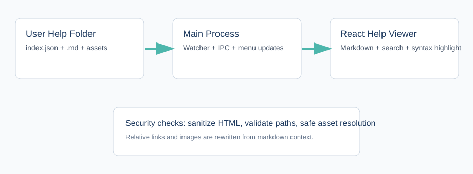

# Getting Started

OpenDeskmate has two main working modes: **Chat Mode** for task conversations and **Build Mode** for workspace-oriented coding workflows.

Project Management sits alongside those modes so you can track project budgets, assign work, manage work items, and keep notes, drawings, documents, and usage together.

## Core Areas

- [Chat Mode](./chat-mode.md)
  - Start a new task, attach files, work in a folder, use memory hints, customize the chat background, view image previews, and continue an existing conversation.
- [Build Mode](./build-mode.md)
  - Pick a workspace, run the project runtime, inspect terminals and logs, capture screenshots, run smoke-test workflows, review Changes & Git, and work with the AI Build Operator.
- [Project Management](./project-management.md)
  - Create usage projects, attach Chat projects and Build presets, manage budgets, assignees, Workboard items, notes, drawings, documents, and analytics.
- [Project Budgets And Usage](./project-budgets-and-usage.md)
  - Track input hit, input miss, and output tokens and costs by project, with optional warning or blocking budget windows.
- [Workboard](./workboard.md)
  - Manage project work in Table, Kanban, Timeline, and Calendar views, including lists, notes, drawings, documents, and prompt generation.
- [Project Work Popup](./project-work-popup.md)
  - Open project lists, notes, drawings, and documents from Chat Mode or Build Mode without leaving the current task.
- [Prompt Navigator](./prompt-navigator.md)
  - Jump between prompts in long Chat and Build conversations.
- [Local Models And Ollama](./local-models-and-ollama.md)
  - Use local Ollama models with capability levels and context limit overrides.
- [Changes And Git](./changes-and-git.md)
  - Review Build Mode file changes, Git status, commit, push, branches, remotes, and mismatch recovery.
- [Slash Commands](./slash-commands.md)
  - Type `/` inside supported prompts, or open the global `Cmd+K` launcher and type `/` there.
- [Saved Prompts And Recipes](./saved-prompts-and-recipes.md)
  - Reuse and organize prompt templates across Chat Mode and Build Mode.
- [Subagents](./subagents.md)
  - Track helper child agents in Chat Mode, Build Mode, or the global Subagents page.
- [Plugins](./plugins.md)
  - Author, install, validate, and inspect controlled plugin contributions.
- [Settings Overview](./settings/overview.md)
  - Review every Settings section, including permission policy, plugins, agents, Build Mode safety, runtime hooks, and diagnostics.

## When To Use This Page

Use this page when you are new to the app or you are not sure whether a task belongs in Chat Mode, Build Mode, Project Management, Settings, or Help.

## Quick Steps

1. Open **Settings** and configure your default model and API keys.
2. Start a task in **Chat Mode** if you want a conversation-first workflow.
3. Switch to **Build Mode** if you need runtime preview, terminals, runtime logs, Git review, screenshots, or workspace-level editing.
4. Open **Project Management** if you want to track usage budgets, client/project details, Workboard items, notes, documents, drawings, or assignees.
5. Use **Saved Prompts And Recipes** for repeatable prompts.
6. Use the **Project Work popup** when you want project work beside the current Chat or Build task.
7. Use **slash commands** for fast navigation and task control.
8. Use **Plugins** if you want manifest-driven commands, hooks, tools, or help docs.
9. Open **Help** whenever you need a page-specific reference.

## Troubleshooting

- If a model will not run, open **Settings > Model & API settings** and check the provider key, model name, and active agent.
- If costs look wrong, open **Settings > API usage estimate** and check input hit, input miss, output, and effective-from pricing.
- If Build Mode opens the wrong folder, check the active workspace and selected preset.
- If a feature is hard to find, search Help using the task you are trying to complete, such as `save answer`, `Git push`, or `budget window`.

## Help System

The Help viewer itself is editable.

- Help pages live in a writable local folder.
- You can edit `.md` files in your own editor.
- Page ordering and titles come from `index.json`.
- Search runs across the loaded help pages inside the app.

## New In v0.5.0

Start with [What's New In v0.5.0](./whats-new-050.md) for the feature tour. [Prompt Controls](./prompt-controls.md) shows where controls moved, and [Actions And Pins](./actions-and-pins.md) explains reusable shortcuts.

A typical flow is: prepare a draft, Send/Run, inspect the [Task journey](./task-journey.md), choose a follow-up if offered, then save useful material to [Scrapbook](./project-scrapbook.md). Choosing an action or guidance card prepares text; it does not automatically send it.

## Related Pages

- [Editing Help Content](./editing-help.md)
- [Help Architecture](./help-architecture.md)
- [Activity Timeline And Recovery](./activity-timeline-and-recovery.md)
- [Build Smoke Testing](./build-smoke-testing.md)
- [Troubleshooting Agent Loops](./troubleshooting-agent-loops.md)
- [Runtime Screenshots](./runtime-screenshots.md)
- [Saving Answers And Exports](./saving-answers-and-exports.md)

