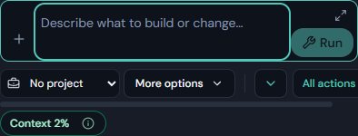
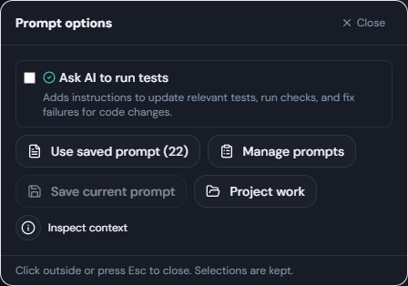

# Prompt Controls

Use this guide to find the first Chat prompt, Chat follow-up, and Build prompt controls.

## Shared Controls

| Control | What it does |
| --- | --- |
| Attach / plus button | Adds files to the prompt. Review attachments before sending. |
| Project selector with briefcase | Groups the task's usage and project work. It does not select a folder on disk. |
| Working-folder button in Chat | Chooses where that Chat task works. Build has its own workspace selection. |
| More options | Opens a floating panel of secondary controls. It does not stretch the prompt card. |
| Pinned actions | Prepares reusable instructions. Hidden pins have a separate down-arrow menu. |
| All actions | Opens the action library, pin controls, and pinning limit. |
| Context percentage and info button | Shows estimated context use and detailed token information. |

Availability depends on the mode and whether an agent is busy. Hover an icon or focus it with the keyboard for its label.

## Open And Close More Options

1. Click **More options** beside the project and action controls.
2. Choose the setting or action you need.
3. Use **Close**, press Escape, or click outside the panel.

Your draft and selected options are retained. Opening the panel does not submit a task. Other dialogs opened from it have their own close controls.

## Build: Write And Run A Prompt

1. Type into **Describe what to build or change…**.
2. The input grows from two lines to about six, then scrolls. Click the expand icon for more writing room; click it again to collapse.
3. Press Enter for a new line. Click **Run**, or press **Ctrl+Enter** on Windows (**Cmd+Enter** on macOS), to submit.
4. While the agent is working, **Stop** replaces Run. You can prepare a draft for later; it cannot be submitted while the current turn is active.
5. The draft clears only after submission is accepted. A rejected submission retains the text.

Build's top **Start preview**, preview **Stop**, **Restart**, and **Build project** controls operate the project runtime or build command. The prompt's **Run/Stop** operates the AI task.

## Build: Find Secondary Controls

Under **More options** you can:

- Toggle **Ask AI to run tests**. **Tests on** below the toolbar indicates it is enabled.
- Use or manage saved prompts, or save the current prompt.
- Open **Project work** and **Inspect context**.
- View the working-folder label and open **Changes & Git** when those controls are needed by the current layout.

The test toggle adds instructions when the task starts. It is not itself a test runner or proof that checks passed.

## Attachments And Narrow Panels

In Build, attachments appear only when present. Two file chips remain visible; **+N files** opens the rest. Each attachment has a remove button, including those in the popup.

Pinned actions stay on one line. Use their down-arrow menu for hidden shortcuts. On very narrow panels, the toolbar can scroll horizontally instead of wrapping onto another row.

## Troubleshooting

- If you see **Stop**, the task is still active, possibly because the main agent is reviewing helper results. Wait for it to finish, or stop it deliberately.
- If a follow-up reports “already running or queued”, keep the retained draft and check the current task and Background work before trying again.
- If the project is wrong, use the briefcase selector. If files are being read from the wrong folder, check the working folder or Build workspace separately.
- Slash-command selection handles Enter while its menu is open. Close that menu before using normal text-entry shortcuts.

## Related Pages

- [Actions And Pins](./actions-and-pins.md)
- [Chat Mode](./chat-mode.md)
- [Build Mode](./build-mode.md)
- [Project Budgets And Usage](./project-budgets-and-usage.md)
